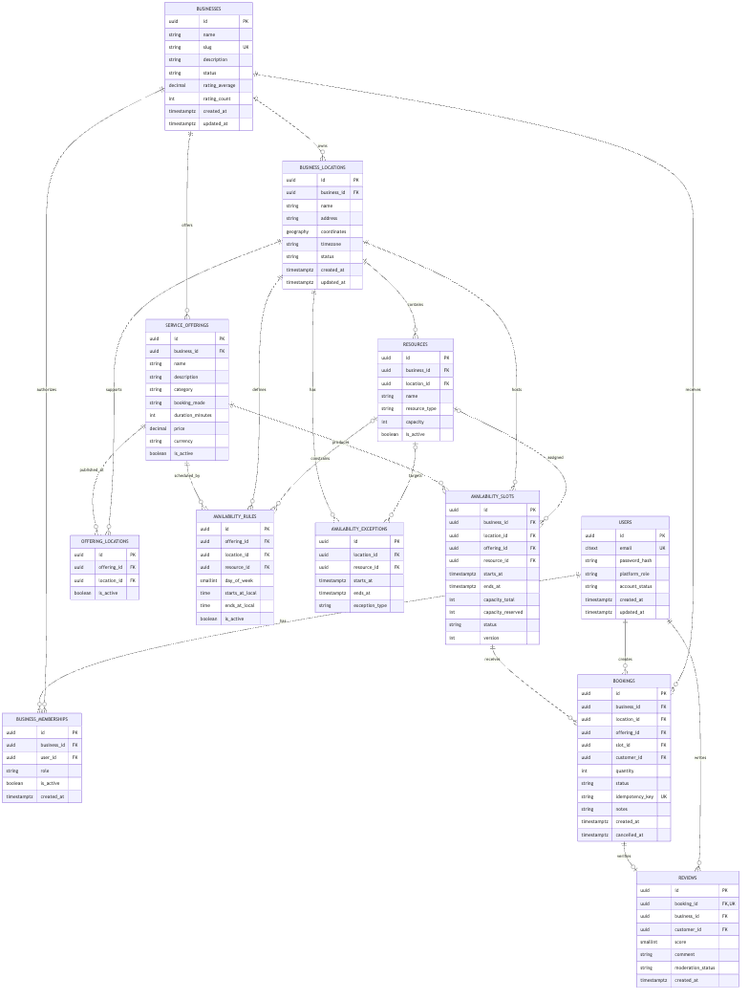

# Bookify — Database Design

## Purpose

PostgreSQL stores transactional booking data. PostGIS is recommended for geospatial filtering. Semantic vectors are a derived search projection, never the source of truth for businesses, ratings or availability.

## Entity relationship diagram

Editable source: [entity-relationship-diagram.mmd](./diagrams/entity-relationship-diagram.mmd).

## Conventions

- UUID primary keys and `snake_case` names.
- `created_at`/`updated_at` are timezone-aware instants.
- Emails are normalized and compared case-insensitively.
- Concrete slots/bookings use UTC instants; locations store IANA timezones.
- Important history is logically deactivated, not physically deleted.
- Foreign keys include the tenant/location context where necessary to prevent cross-tenant references.

## Core entities

### `users`

Identity for customers, business staff and platform administrators. Contains normalized unique email, password hash, account/platform roles and audit timestamps.

### `businesses`

Tenant root and brand-level profile. A business can have multiple locations, staff memberships and offerings.

### `business_memberships`

Many-to-many relationship between users and businesses with a role and active state. Unique (`business_id`, `user_id`).

### `business_invitations`

Pending and historical invitations to a business. Stores the normalized recipient email,
assigned role, lifecycle status, expiry, inviter and optional acceptance audit fields. Only a
SHA-256 token hash is persisted. PostgreSQL enforces at most one `PENDING` invitation per
business and case-insensitive email; accepted, revoked and expired rows remain as history.

### `business_locations`

Physical place where a booking happens. Contains address, IANA timezone and `geography(Point, 4326)` coordinates. Distance filtering uses a GiST index.

### `service_offerings`

What a customer books:

- name and description;
- category;
- `booking_mode`: `APPOINTMENT`, `EXCLUSIVE_RESOURCE` or `CAPACITY_SESSION`;
- duration;
- optional fixed-precision price and currency;
- active state.

### `offering_locations`

Makes an offering bookable at one or more locations and can override capacity or price later without duplicating the offering.

### `resources`

Bookable assets at a location, such as a staff member, court, room, chair, table or equipment. Includes type, capacity and active state.

### `availability_rules`

Recurring local-time rules for an offering/location and optionally a resource. Multiple daily intervals are allowed. Rules generate concrete slots within a bounded future horizon.

### `availability_exceptions`

Dated closures or overrides for a location/resource. Concrete instants are stored in UTC.

### `availability_slots`

Concrete reservable intervals generated or manually created for an offering/location. Important fields:

- optional `resource_id`;
- `starts_at`, `ends_at`;
- `capacity_total`, `capacity_reserved`;
- status and optimistic `version`.

Exclusive resources use total capacity `1`. Capacity sessions atomically reserve one or more places. Slot generation is idempotent through a unique natural key.

### `bookings`

Links customer, business, location, offering and slot. Contains quantity/party size, state, notes, idempotency key and audit/cancellation timestamps.

Unique (`customer_id`, `idempotency_key`). Business/location/offering/slot consistency is enforced using composite constraints or reviewed database triggers.

### `reviews`

One verified rating per completed booking. Contains score 1–5, optional text, moderation state and audit timestamps. Unique `booking_id`.

## Relationships

- Business 1 → N locations, memberships, invitations and offerings.
- User 1 → N memberships, bookings and reviews.
- Offering N ↔ N locations through `offering_locations`.
- Location 1 → N resources, rules, exceptions, slots and bookings.
- Offering 1 → N rules, slots and bookings.
- Resource 1 → N optional rules, exceptions and slots.
- Slot 1 → N bookings only when its capacity permits.
- Booking 1 → 0..1 review.

## Availability and concurrency

1. Convert requested local time using the location timezone.
2. Find active offerings/locations and eligible slots.
3. Apply structured filters before semantic ranking.
4. During booking creation, lock the selected slot row.
5. Verify `capacity_reserved + requested_quantity <= capacity_total`.
6. Atomically increment capacity and insert the booking.
7. On cancellation, atomically release capacity exactly once.

For exclusive-resource intervals that are not pre-generated, PostgreSQL exclusion constraints can protect overlapping `tstzrange` values. The first implementation should choose either slot locking or range exclusion per booking mode and capture it in a migration ADR.

The first implemented mode uses direct exclusive-resource booking intervals rather than
persisted slot rows. Application transactions lock the resource and PostgreSQL additionally
rejects overlapping active `tstzrange` values. Shared-capacity sessions will use concrete
capacity rows and atomic counters in a separate policy.

`booking_status_history` is append-only application data for operational traceability. It
stores the tenant, booking, actor, previous/new state, reason and UTC timestamp. The
business/booking composite foreign key prevents cross-tenant audit records.

## Geospatial search

- Coordinates use validated longitude/latitude and stored geocoding provenance.
- `ST_DWithin` applies a hard radius filter.
- `ST_Distance` calculates display/ranking distance.
- The platform must not infer or fabricate a location through an LLM.

## Ratings

Maintain `rating_average` and `rating_count` as a rebuildable projection for search performance. The `reviews` table remains authoritative. Bayesian smoothing or minimum-count rules should prevent a single five-star review from dominating mature listings.

## AI search projection

An asynchronous projection may store:

- business/location/offering IDs;
- normalized searchable text;
- structured category and status metadata;
- embedding vector plus model/version;
- projection timestamp.

The projection contains no authoritative availability. Search rechecks current structured data before presenting or booking results. Changing the embedding model requires reindexing and versioned evaluation.

## Initial indexes

- Unique normalized user email.
- Memberships by (`user_id`, `is_active`).
- Locations GiST index on coordinates.
- Offerings by (`business_id`, `category`, `is_active`).
- Resources by (`location_id`, `type`, `is_active`).
- Slots by (`location_id`, `offering_id`, `starts_at`, `status`).
- Bookings by (`business_id`, `starts_at`, `status`) and (`customer_id`, `created_at desc`).
- Reviews by (`business_id`, `moderation_status`) as needed by aggregate jobs.

Validate indexes with production-like data and `EXPLAIN (ANALYZE, BUFFERS)`.

## Migration policy

- Use reviewed, versioned migrations.
- Production uses Hibernate schema validation, never `ddl-auto: update`.
- Migrations are forward-only and tested against PostgreSQL/PostGIS.
- Destructive changes require expand/migrate/contract planning and a verified backup.
