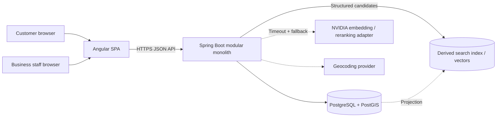

# Bookify — System Architecture

## Context

Bookify combines a multi-tenant business SaaS, a customer marketplace, a transactional booking engine and optional AI-assisted discovery. It starts as a modular monolith.

## Separation of responsibilities

### Transactional core

Identity, tenants, catalog, schedules, availability, bookings and reviews live in PostgreSQL. This path owns truth and remains functional without AI.

### Discovery

Search first applies hard eligibility filters: active status, category, geographic radius and optionally availability. Semantic similarity improves recall over indexed descriptions. A bounded reranker can combine semantic relevance with distance, verified rating, availability and business rules.

### NVIDIA integration

NVIDIA NeMo Retriever Embedding NIM can produce semantic embeddings, and Reranking NIM can reorder a limited candidate set. Both are external adapters with:

- strict timeouts and circuit breaking;
- feature flags and deterministic fallback;
- model/version metadata;
- latency, cost and quality metrics;
- no direct write access to bookings.

NVIDIA documents embedding and reranking as separate retrieval building blocks. Reranking adds relevance but also latency/cost, so it should only run on a bounded top set.

## Trust boundaries

- Browser, listing descriptions, reviews and provider output are untrusted inputs.
- Identity comes from validated authentication; tenant access comes from memberships.
- Coordinates come from a validated geocoding workflow or verified business input.
- AI output references canonical IDs and cannot create factual records.
- Availability is revalidated transactionally at booking time.

## Deployment evolution

Initial topology:

- Angular static hosting/CDN.
- Stateless Spring Boot instances.
- Managed PostgreSQL with PostGIS.
- Provider-hosted NVIDIA API/NIM experiment or a separately deployed adapter.

Do not operate dedicated GPU infrastructure until benchmarks show product value, acceptable unit economics and a workload that justifies it. Search projections and AI adapters can be separated later without extracting the booking domain.

## Failure behavior

- AI unavailable: use structured text/category/distance/rating search.
- Search index stale: fetch canonical records and recheck eligibility.
- Geocoder unavailable: preserve existing verified coordinates; delay new geocoding.
- Concurrent capacity request: one transaction succeeds within the remaining capacity; excess requests return `409`.
- Notification failure: preserve the committed booking.

Internal boundaries are defined in [Software Architecture](./software-architecture.md).
